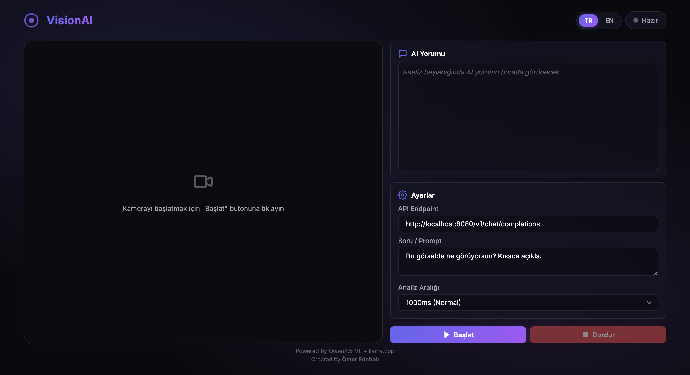
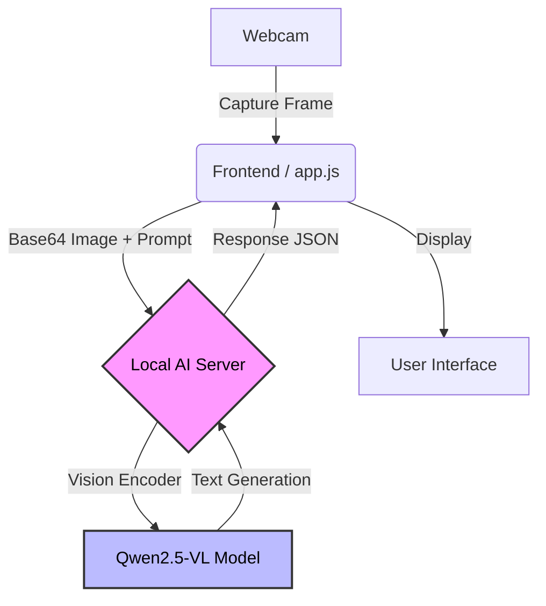

# 🎥 VisionAI

Real-time webcam analysis with local AI vision models.

<div align="center">
  
  <p><em>Modern dark-themed interface with real-time AI analysis</em></p>
</div>

## Quick Start

```bash
# 1. Install llama.cpp
brew install llama.cpp

# 2. Start the AI server
./scripts/start-server.sh

# 3. Open in browser
open src/index.html
```

## Features

- **Real-time Analysis** — Continuous webcam frame analysis
- **Local AI** — No cloud API, 100% privacy
- **Multilingual** — One-click TR/EN switching with auto-translated prompts
- **Zero Cost** — Free, unlimited usage

## Requirements

- macOS with Apple Silicon
- llama.cpp (`brew install llama.cpp`)
- Modern browser (Chrome, Safari, Firefox)

## Tech Stack

| Component | Technology |
|-----------|------------|
| Model | Qwen2.5-VL-3B-Instruct |
| Backend | llama.cpp server |
| Frontend | Vanilla JS + CSS |

## How it Works

The application runs entirely on your local machine, ensuring privacy and speed.



## Project Structure

```
vision-ai/
├── assets/
│   └── screenshot.png
├── src/
│   ├── index.html    # Main UI
│   ├── styles.css    # Dark theme
│   └── app.js        # Webcam & API logic
├── scripts/
│   └── start-server.sh
└── README.md
```

## License

MIT
